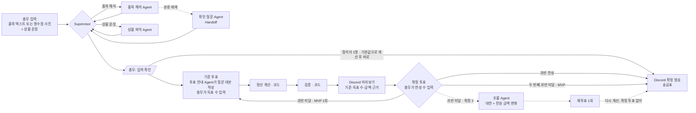

# 공정 N빵 정산기 — 계획서

> 멀티 에이전트 미니 프로젝트 · 폴더: `바탕 화면\공정 N빵 정산기` (구 `mini_multi_agent_04_fair_split`)
> 세부 문서: [CALC_SPEC](CALC_SPEC.md) · [VOTING_SPEC](VOTING_SPEC.md) · [AGENTS](AGENTS.md) · [TEST_PLAN](TEST_PLAN.md)
> 작성일 2026-09-30 · 적용 과정: 03 Supervisor · 05 Handoff · 06 승인(총무 입력 + 참석자 과반 확정)

---

## 1. 한 줄 요약

총무가 영수증(또는 품목 목록)과 "지우 술 안 마심, 민수 10시에 감" 같은 상황을 입력하면 회식비를 나눠 주는 정산기입니다. **계산 기준은 금액을 보기 전에 그 자리에서 손을 들어 정하고**, 총무가 득표 수를 입력합니다. 결과는 **득표 수, 각자의 계산 근거, 송금표와 함께 Discord로** 공유합니다.

> **돈 계산과 표 집계는 코드가, 영수증과 사람 말의 해석과 투표 안내는 에이전트가 맡는다.**

## 2. 문제 정의

| 지금 겪는 문제 | 원인 |
|---|---|
| 술 안 마신 사람, 일찍 간 사람도 똑같이 냄 | 계산이 귀찮아서 그냥 N빵 |
| 총무가 기준을 정하면 "왜 네 마음대로?"가 됨 | 기준을 정한 절차와 기록이 없음 |
| 금액을 본 뒤 기준을 바꾸자는 사람이 나옴 | 결과를 보고 유리한 기준을 고름 |
| 총무가 계산하느라 30분 동안 영수증을 붙잡고 있음 | 영수증 해석과 송금 정리를 손으로 함 |

## 3. 목표와 범위

### 3.1 목표
1. 4~8명 회식을 **10분 안에** 정산한다 (입력, 투표, 확정까지).
2. 참석자 모두가 **자기 금액의 근거와 기준 투표 결과**를 Discord에서 확인할 수 있다.
3. Supervisor, Handoff, 사람 확정을 **MVP 안에서** 모두 사용한다.

### 3.2 사용 방식

- 앱은 **총무 한 명만** 씁니다. 참석자는 앱에 접속하지 않습니다.
- 투표는 그 자리에서 **말이나 손들기**로 하고, 총무가 **항목별 득표 수**를 입력합니다.
- 참석자는 **Discord 채널**에서 미리보기와 확정 결과를 봅니다.

### 3.3 범위

| 구분 | 내용 |
|---|---|
| **MVP** | 품목 텍스트 + 상황 문장 입력 → 해석 (**애매한 품목은 확인 질문 Handoff**) → 기준 투표(총무 입력) → 계산 → Discord 미리보기 → 확정 투표(총무 입력) → Discord 확정 발송, 1차만 |
| **확장 1** | 영수증 사진 해석 |
| **확장 2** | 2차 이상 입력 화면, 이의 조율 Agent + 재투표 (계산기는 1일차부터 여러 차수를 지원) |
| **확장 3** | 참석자가 각자 휴대폰으로 투표 (참여 링크) |
| **제외** | 실제 송금·결제 연동, 카카오톡 연동, 회원 가입 |

## 4. 공정성 원칙

이 프로젝트에서 "공정하다"는 아래 7가지를 지킨다는 뜻입니다.

| # | 원칙 | 구현 방법 |
|---|---|---|
| P1 | **기준은 금액을 보기 전에 투표로 정한다.** 결과가 나온 뒤에는 바꾸지 않는다. | 기준 득표 수를 입력하고 잠그기 전에는 앱이 금액 화면을 열지 않음 |
| P2 | **개인 조건은 본인 신고로 정한다.** 많이 먹음 가중치를 반영할지는 투표로 정하지만, 대상자는 본인이 신고한 사람뿐이다. | 다른 사람 지목 없음 |
| P3 | **증거가 있는 조건만** 금액에 반영한다. | 영수증 품목, 참석 시간, 술 여부, 본인 신고 |
| P4 | 모든 사람은 **자기 금액의 계산 근거**를 항목별로 볼 수 있다. | Discord 메시지에 사람별 근거 포함 |
| P5 | 같은 입력이면 항상 같은 결과가 나온다. | 계산과 집계는 LLM이 아니라 코드가 맡음 |
| P6 | 누군가의 금액이 바뀌면, 그 차액을 누가 떠안는지 **전원의 금액 변화**를 함께 보여 준다. | MVP: 기준 투표를 다시 하면 새 미리보기에 이전안 대비 전원의 금액 변화를 표시. 확장 2: 조율 대안 비교표 |
| P7 | **총무의 입력도 공개한다.** 총무가 입력한 득표 수와 조건이 결과와 함께 Discord에 올라간다. | 총무가 표를 잘못 세거나 바꿔도 참석자가 확인하고 이의를 낼 수 있음 |

## 5. 투표 규칙 (요약)

자세한 규칙은 [VOTING_SPEC](VOTING_SPEC.md)에 있습니다.

### 5.1 기준 투표 (계산 전)

앱이 **총무가 읽어 줄 질문**을 보여 주고, 총무는 손든 사람 수를 입력합니다. 금액은 보여 주지 않습니다.

| 항목 | 선택지 | 기본값 |
|---|---|---|
| 술값 | 마신 사람만 / 전원 | 마신 사람만 |
| 일찍 간 사람 | 시간 비례 / 떠나기 전 주문까지만 / 똑같이 | 시간 비례 |
| 많이 먹은 사람 가중치 | 반영 안 함 / 1.2배 / 1.5배 | 반영 안 함 |
| 할인·쿠폰 | 각자 부담 비율대로 / 똑같이 | 비율대로 |
| 끝전 | 결제자 부담 / 무작위 | 결제자 부담 |

- 해당 없는 항목은 건너뜁니다. 예: 일찍 간 사람이 없으면 "일찍 간 사람" 항목 없음.
- 득표 수의 합은 참석자 수를 넘을 수 없습니다. 모자란 만큼은 기권입니다.
- 가장 많이 받은 선택지를 채택하고, 동점이면 **기본값**을 채택합니다.

### 5.2 확정 투표 (계산 후)

- 총무가 Discord로 **미리보기**를 보내고, 모두 확인한 뒤 찬성 수를 입력합니다.
- **참석자 과반**(투표한 사람이 아니라 참석자 수 기준)이 찬성하면 확정하고, Discord로 확정 결과를 보냅니다.
- 과반 미달이면 총무가 반대 이유를 입력합니다.
  - **MVP:** 기준 투표부터 **한 번만** 다시 합니다. 새 미리보기에는 이전안 대비 전원의 금액 변화가 붙습니다(P6). 두 번째 확정 투표도 과반 미달이면 **두 번째 기준 투표 결과로 확정**하고 그 사실을 Discord에 알립니다.
  - **확장 2:** 조율 Agent가 대안을 만들고 **재투표를 1회만** 합니다. 선택지는 현재안과 대안들이고, 최다 득표안으로 다시 계산해 **확정 투표 없이** 확정합니다. 동점이면 현재안으로 확정합니다.
- 참석자가 1명이면 투표 없이 기본값으로 계산하고 바로 확정합니다.

## 6. 전체 흐름



> 점선은 확장 2입니다. 참석자가 1명이면 기본값으로 계산한 뒤 미리보기와 확정 투표 없이 바로 확정합니다. 검증 V1·V2는 입력 확인 때, V7은 득표 입력 때, V3~V5는 계산 직후에 합니다.

## 7. 에이전트 설계

| 노드 | 종류 | LLM | 입력 → 출력 |
|---|---|---|---|
| `supervisor` | 라우터 (규칙 기반) | ✗ | 현재 상태 → 다음 노드 (`Command(goto=...)`) |
| `item_reader` | 워커 | ✓ (사진이면 비전) | 품목 텍스트 또는 영수증 사진 → 품목 목록 (이름, 가격, 수량, 분류, 확신도) |
| `clarifier` | Handoff 대상 | ✓ | 애매한 품목 → 총무에게 할 짧은 질문 → 답을 반영한 분류 |
| `situation_parser` | 워커 | ✓ | 상황 문장 → 참석자별 조건 (술 여부, 시간, 차수, 본인 신고) + 차수별 정보 (시각, 결제자) |
| `vote_host` | 워커 | ✓ | 투표 항목 → 총무가 읽어 줄 **질문 대본**, Discord 안내 문장 |
| `calculator` | 함수 | ✗ | 확정 기준 + 품목 + 참석자 → 1인당 금액과 근거 |
| `validator` | 함수 | ✗ | 계산 결과 → 통과 / 중단 (V3~V5). V2·V7은 입력 화면에서 바로 확인 |
| `settler` | 함수 | ✗ | 1인당 금액 + 결제 내역 → 최소 송금표 |
| `mediator` *(확장 2)* | 워커 | ✓ | 반대 이유 → 대안 2~3개 (**기준 선택지 안에서만**) + 전원 금액 변화 |
| `notifier` | 함수 | ✗ | 미리보기·확정 메시지(확장 2는 대안 비교표도) → Discord 웹후크 (없으면 복사용 문구) |

### 7.1 Supervisor 라우팅 규칙 (03)
1. 품목 입력(텍스트 또는 사진)이 있고 아직 해석하지 않았으면 `item_reader`로 보낸다.
2. 상황 문장이 있고 아직 해석하지 않았으면 `situation_parser`로 보낸다. (해석에 실패해도 "해석함"으로 표시해서 같은 노드를 반복하지 않는다.)
3. 총무가 입력을 확인하지 않았으면 입력 확인 화면에서 멈춘다.
4. 기준이 아직 없으면 `vote_host`로 보낸다 (기준 투표 대본).
5. 기준이 확정되면 `calculator` → `validator` → `settler` → `notifier`(미리보기) 순서로 보낸다.
6. 확정 투표가 과반 미달이면 MVP에서는 기준 투표로 한 번 되돌리고, 두 번째 미달이면 확정한다. 확장 2에서는 `mediator`로 보낸다.
   참석자가 1명이면 투표 없이 기본값으로 계산하고 확정한다.
7. 무한 루프를 막기 위해 최대 방문 횟수는 15회로 둔다. (보통 경로는 10회 이하)

### 7.2 Handoff (05)
- `item_reader`는 품목마다 `confidence`를 매기고, 분류가 애매하면 **스스로** `needs_clarification=true`로 표시합니다.
  - 예: "모둠세트 A 35,000" → 술이 포함됐는지 알 수 없음
- **텍스트 입력에서도** Handoff가 일어나므로, 영수증 사진 없이 MVP만으로도 05를 시연할 수 있습니다.
- 표시된 품목이 있으면 `clarifier`로 넘깁니다. 넘길 때는 **애매한 품목만** 전달합니다.
- 질문은 한 번에 최대 3개까지만 합니다. 총무가 "모름"을 고르면 "음식"으로 분류하고 근거에 표시합니다.

### 7.3 조율 Agent의 한계 (공정성 보호)
- 대안은 **5장의 기준 선택지 안에서만** 만듭니다. 특정 사람만 깎아 주는 새 규칙은 만들지 않습니다.
- 대안마다 **전원의** 금액 변화를 보여 줍니다 (P6).
- 결정은 하지 않습니다. 재투표로 넘깁니다.

## 8. 계산 규칙

기호: 참석자 *i*, 차수 *r*, 가중치 *wᵢ* (기본 1.0, 많이 먹음이면 1.2 또는 1.5, **음식·음료에만 적용**), 시간 계수 *τᵢ* ("시간 비례"면 머문 시간 비율, 아니면 1). 숫자 예시는 [CALC_SPEC.md](CALC_SPEC.md)에 있습니다.

| 비용 | 나누는 방법 |
|---|---|
| **술** | 기준이 "마신 사람만"이면 그 차수에서 술 마신 사람끼리, "전원"이면 참석자 모두가 *τᵢ* 비율로 나눕니다. 가중치 *wᵢ*는 적용하지 않습니다. |
| **음식·음료** | *wᵢ × τᵢ* 비율로 나눕니다. "떠나기 전 주문까지만"이면 떠난 뒤 주문한 품목에서 그 사람을 뺍니다(술에도 똑같이 적용). 주문 시각을 모르는 품목은 그 자리에 있던 사람 모두가 나눕니다. |
| **할인·쿠폰** | 기본은 할인 전 부담액 비율대로 뺍니다. |
| **2차 이상** | 차수마다 따로 계산한 뒤 사람별로 더합니다. 그 차수에 없던 사람은 0원입니다. |
| **끝전** | 차수마다 100원 단위로 내림하고, 남는 금액은 그 차수 결제자가 부담하거나 무작위로 한 명이 부담합니다. 무작위는 정산 ID로 시드를 고정해 다시 계산해도 같은 사람이 나옵니다(P5). |
| **송금표** | 사람별 (낸 돈 − 낼 돈)을 계산한 뒤, 송금 횟수가 가장 적도록 짝을 짓습니다. |

## 9. 검증 (코드)

| 검사 | 실패하면 |
|---|---|
| V1. 차수마다 품목 합계 − 할인 = 그 차수 결제 총액 (총무가 카드 영수증을 보고 입력) | 입력 확인 때: 차이 금액을 보여 주고 총무가 품목이나 총액을 고칠 때까지 확인 불가. 해석 직후 영수증 총액과 다르면: `clarifier`로 금액 확인 질문 |
| V2. 참석자 명단 = 입력한 인원, 이름 중복 없음, 결제자가 명단에 있음 (입력 확인 때) | 입력 확인 화면으로 되돌림 |
| V3. 차수마다 1인당 금액 합계 = 그 차수 결제 합계 (1원 단위) | 계산 버그로 보고 중단 |
| V4. 모든 금액 ≥ 0 | 중단 |
| V5. 모든 사람에게 근거 항목이 1개 이상 있음 | 중단 |
| V6. 조율 대안이 기준 선택지 안에 있음 | 그 대안을 버림 |
| V7. 항목별 득표 수 합계 ≤ 참석자 수, 음수 없음 (득표 입력 때) | 득표 입력 화면으로 되돌림 |

## 10. 데이터 모델 (요약)

```python
class Item(BaseModel):
    name: str; price: int; qty: int = 1
    category: Literal["food", "alcohol", "drink"]
    round: int = 1; ordered_at: str | None = None
    confidence: float = 1.0; needs_clarification: bool = False

class Person(BaseModel):
    name: str; rounds: list[int]; drinks_alcohol: bool
    arrived: str | None; left: str | None
    self_reported_heavy: bool = False

class Round(BaseModel):          # 차수 정보
    round: int; start: str; end: str     # 시간 비례(τ) 계산용
    total: int                           # 결제 총액 (총무가 카드 영수증을 보고 입력, V1 기준)
    discount: int = 0
    payments: dict[str, int]             # {"해든": 110000} — 결제자별 금액 (끝전 부담자 결정)

class Rules(BaseModel):          # 기준 투표 결과
    alcohol: Literal["drinkers", "all"]
    early_leave: Literal["time", "before_leave", "equal"]
    heavy_weight: Literal[1.0, 1.2, 1.5]
    discount: Literal["ratio", "equal"]
    remainder: Literal["payer", "random"]
    # Rules.default() = 투표 기본값 (drinkers, time, 1.0, ratio, payer). 동점·전원 기권·참석자 1명일 때 사용

class Tally(BaseModel):          # 총무가 입력한 득표 수
    item: str; counts: dict[str, int]; attendees: int

class Share(BaseModel):          # 사람별 결과
    name: str; amount: int
    breakdown: list[str]         # "1차 음식·음료 80,000원 중 21,818원", "1차 술 0원 (안 마심)" ...
```

## 11. 기술 구성

| 항목 | 선택 | 이유 |
|---|---|---|
| 그래프 | LangGraph `StateGraph` + `Command` | PM 에이전트와 같은 구조 |
| LLM | OpenAI `gpt-4o-mini` (비전 포함), 오프라인용 FakeLLM | 비용이 낮고 영수증 이미지를 읽을 수 있음 |
| 화면 | Streamlit, **총무 PC나 노트북에서 로컬 실행** (`streamlit run app.py`) | 총무 한 명만 쓰므로 배포나 동시 접속 처리가 필요 없음 |
| 대기·재개 | LangGraph `interrupt` + SQLite 체크포인터 | 입력 확인·득표 입력을 기다리는 동안 그래프를 멈췄다가 이어서 실행, 앱을 닫아도 이어서 진행 |
| 공유 | **Discord 웹후크** (PM 에이전트 `notify.py` 재사용). 웹후크가 없으면 복사용 문구 | 참석자가 앱 없이 결과·근거·득표 수를 확인 |
| 비밀값 | `.env`의 `OPENAI_API_KEY`, `DISCORD_WEBHOOK_URL` (git에 올리지 않음) | |
| 테스트 | pytest, 품목·상황 fixture | 계산기와 검증은 100% 테스트 |

## 12. 일정 (3일, 마감 10/3 토)

| 날짜 | 작업 | 산출물 | 과정 |
|---|---|---|---|
| **1일차** 10/1 (목) | 데이터 모델, 계산기(여러 차수), 송금 정리, 검증 + 테스트 (CALC_SPEC 예시 전부 통과) · 품목 해석 Agent(텍스트) + 확인 질문 Handoff · 상황 파악 Agent | `calculator.py`, `agents/`, 테스트 | 05 |
| **2일차** 10/2 (금) | Supervisor 그래프 + 득표 입력·집계 · Streamlit 총무 화면 · Discord 미리보기·확정 발송 | **MVP** (03·05·06 모두 포함) | 03 · 06 |
| **3일차** 10/3 (토) | 실제 회식 데이터 1건으로 E2E · 상황 문장 10개 평가 · 시연 영상, 발표 자료 · 제출 | 시연 영상, 슬라이드 | — |

- 계산기는 1일차부터 여러 차수를 지원합니다(CALC_SPEC E6·E7). 화면에서 2차를 입력하는 건 확장 2입니다.
- 오늘(9/30)은 환경 준비만 합니다: 폴더 이동, 가상환경, `OPENAI_API_KEY`·`DISCORD_WEBHOOK_URL`을 `.env`에 넣기.
- **3일차 오전까지 MVP가 안 끝나면** 테스트 평가를 줄이고 시연 영상부터 찍습니다.
- **확장 1(영수증 사진)**은 2일차에 MVP가 끝나고 시간이 남을 때만 합니다. 확장 2(조율 Agent)와 확장 3(각자 투표)은 이번 제출에서 빼고, 발표에서 "다음 단계"로 소개합니다.

## 13. 리스크와 대응

| 리스크 | 대응 |
|---|---|
| 총무가 표를 잘못 세거나 유리하게 입력함 | 득표 수와 조건을 Discord 미리보기에 공개 (P7), V7 검증, 확정 투표에서 참석자 과반 필요 |
| 영수증 사진을 잘못 읽음 | 확신도가 낮은 품목은 확인 질문, V1 합계 검증, 총무 입력 확인 화면 |
| 술과 음식이 묶인 세트 메뉴 | 확인 질문 Agent가 "술 포함?"을 묻고, "모름"이면 음식으로 분류해 근거에 표시 |
| 주문 시각을 알 수 없음 | 시각이 없는 품목은 참석자 모두가 나누고 근거에 "주문 시각 모름"으로 표시. 투표 대본에서 "떠나기 전 주문까지만"은 시각이 입력된 품목에만 적용된다고 안내 |
| "많이 먹음"으로 분위기가 상함 | 본인 신고만 반영, 다른 사람 지목 없음 |
| 이의 제기가 끝나지 않음 | MVP: 기준 투표는 한 번만 다시 하고, 또 부결되면 두 번째 결과로 확정. 확장 2: 재투표 1회, 동점이면 현재안으로 확정 |
| LLM이 계산을 틀림 | LLM은 계산하지 않음, 합계 검증(V3) |
| Discord 채널에 없는 참석자 | 복사용 문구를 함께 만들어 단톡방에 붙여 넣기 |
| "그냥 계산기 아니냐"는 질문 | 7장: 품목과 대화 해석, Handoff, 투표 대본은 에이전트가 맡고 계산과 집계는 코드가 맡는 설계라고 설명 |

## 14. 시연 시나리오 (발표용)

1. 총무가 품목 목록("삼겹살 4인분 64000, 모둠세트 A 35000, …")과 "지우 술 안 마심, 민수 10시에 감"을 입력합니다.
2. "모둠세트 A에 소주 포함?"이라는 확인 질문이 나옵니다 (**Handoff**).
3. 총무가 앱이 보여 주는 질문을 읽고, 손든 사람 수를 입력합니다 (**금액을 보기 전**).
4. Discord에 미리보기가 올라옵니다. 기준, 득표 수, 각자 금액과 근거가 들어 있어요.
5. 민수가 반대해 과반 미달이 되면, 기준 투표를 한 번 더 합니다. 새 미리보기에는 **전원의 금액 변화**가 붙습니다.
6. 과반 찬성으로 확정되면, Discord에 송금표가 올라옵니다.
7. (다음 단계 소개) 조율 Agent가 반대 이유를 읽고 대안을 제시하는 확장 2, 참석자 각자 투표하는 확장 3.

## 15. 결정 사항

- [x] 화면: Streamlit, 총무 한 명만 사용 (로컬 실행)
- [x] 투표: 그 자리에서 손들기, 총무가 득표 수 입력 → 참석자 각자 투표는 확장 3
- [x] 결과 공유: Discord 웹후크 + 복사용 문구
- [x] 확정 기준: 참석자 과반
- [x] Handoff: 텍스트 입력에서도 발생 → 영수증 사진은 확장 1
- [x] Discord 채널: 기존 서버의 채널 사용 (그 채널에 "N빵 정산기" 이름으로 웹후크를 하나 더 만들어 PM 에이전트 메시지와 구분)
- [x] 제출 마감일: 10/3 (3일) → 12장 3일 일정, 확장 2·3 제외
