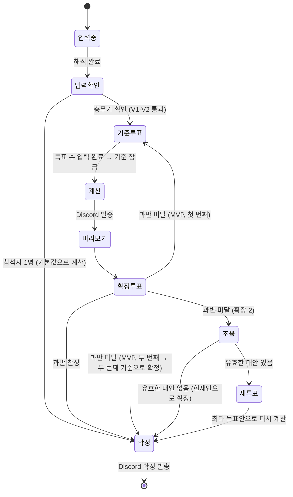

# 투표 명세 — 공정 N빵 정산기

> 기준 투표, 확정 투표, 재투표의 규칙과 상태를 정의합니다.
> **투표 방식:** 그 자리에서 말이나 손들기로 투표하고, **총무가 항목별 득표 수를 앱에 입력**합니다. 참석자는 앱에 접속하지 않습니다.
> 집계는 모두 코드가 합니다. `vote_host` Agent는 총무가 읽어 줄 질문 대본과 Discord 안내 문장만 만듭니다.
> 관련 문서: [PLAN 5장](PLAN.md#5-투표-규칙-요약) · [CALC_SPEC](CALC_SPEC.md)

## 1. 투표 종류

| 종류 | 언제 | 무엇을 | 총무가 입력하는 것 | 통과 기준 |
|---|---|---|---|---|
| **기준 투표** | 계산 전 | 술값, 일찍 간 사람, 가중치, 할인, 끝전 | 항목별 선택지마다 손든 사람 수 | 항목별 최다 득표 (동점이면 기본값) |
| **확정 투표** | 계산 후, Discord 미리보기를 본 뒤 | 이 정산안으로 확정할지 | 찬성 수, 반대 이유 | **참석자 과반** 찬성 |
| **재투표** *(확장 2)* | 확정 투표가 부결됐을 때 **1회만** | 현재안과 조율 Agent의 대안 중 선택 | 선택지마다 손든 사람 수 | 최다 득표 (동점이면 현재안) |

> **과반**은 **참석자 수**를 기준으로 합니다. 투표한 사람 수가 기준이 아닙니다. 4명이면 3표가 필요해요. 기권이 많아도 소수가 결정하지 못하게 하기 위해서입니다.

## 2. 상태



| 상태 | 앱에 금액 표시 | 기준 변경 |
|---|---|---|
| 입력중 · 입력확인 · 기준투표 | **✗ (P1)** | 투표로만 |
| 계산 · 미리보기 · 확정투표 | ✓ (기준 투표를 다시 한 경우 이전안 대비 전원 금액 변화 포함, P6) | ✗ |
| 조율 · 재투표 | ✓ (대안별 전원 금액 변화) | 재투표로만 |
| 확정 | ✓ | ✗ (잠김) |

- MVP에서 과반 미달로 기준 투표를 다시 하는 건 **1회만** 합니다. 두 번째도 과반 미달이면, 두 번째 기준 투표 결과로 확정하고 그 사실을 Discord에 알립니다.

## 3. 기준 투표

### 3.1 항목과 선택지

| 항목 | 선택지 (코드 값) | 기본값 |
|---|---|---|
| 술값 | 마신 사람만 (`drinkers`) / 전원 (`all`) | `drinkers` |
| 일찍 간 사람 | 시간 비례 (`time`) / 떠나기 전 주문까지만 (`before_leave`) / 똑같이 (`equal`) | `time` |
| 많이 먹은 사람 가중치 | 반영 안 함 (`1.0`) / 1.2배 / 1.5배 | `1.0` |
| 할인·쿠폰 | 비율대로 (`ratio`) / 똑같이 (`equal`) | `ratio` |
| 끝전 | 결제자 (`payer`) / 무작위 (`random`) | `payer` |

- **해당 없는 항목은 건너뜁니다.**
  - 일찍 간 사람이 없으면 "일찍 간 사람" 항목이 없습니다.
  - 할인이 없으면 "할인" 항목이 없습니다.
  - 본인 신고한 "많이 먹음"이 없으면 가중치 항목이 없습니다.
- 모든 참석자가 모든 항목에 투표할 수 있습니다. 술을 안 마신 사람도 술값 항목에 투표합니다.

### 3.2 질문 대본

`vote_host`가 항목마다 총무가 그대로 읽을 문장을 만듭니다.

> "술값은 술 마신 사람끼리만 나눌까요, 다 같이 나눌까요? 마신 사람끼리만 나누자는 분 손 들어 주세요."

- 대본에는 **금액과 참석자 이름을 넣지 않습니다** (P1). 누구에게 유리한지도 말하지 않습니다.
- LLM이 실패하거나 금지 내용이 들어가면 템플릿 문장을 씁니다.

### 3.3 입력과 집계

1. 총무는 선택지마다 손든 사람 수를 입력합니다.
2. **검증 V7:** 한 항목의 득표 합계가 참석자 수를 넘거나 음수가 있으면 다시 입력하게 합니다. 합계가 참석자 수보다 적으면, 모자란 만큼은 기권입니다.
3. 가장 많이 받은 선택지를 채택합니다.
4. 동점이면 **기본값**을 채택합니다. 동점인 선택지 중에 기본값이 없으면, 동점 선택지 중 **목록에서 먼저 나온 것**을 채택합니다.
5. 전원 기권(합계 0)이면 기본값을 채택합니다.
6. 입력을 마치면 **기준이 잠기고**, 그때부터 금액을 볼 수 있습니다.

## 4. 개인 조건 (본인 신고)

| 조건 | 정하는 방법 |
|---|---|
| 술 마심 여부, 도착·떠난 시각, 참석 차수 | 상황 문장에서 해석한 뒤, 총무가 입력 확인 화면에서 참석자에게 **읽어 주고** 확인 |
| 많이 먹음 | **본인이 말한 경우에만** 총무가 체크. 다른 사람이 지목한 건 반영하지 않음 |

- 상황 문장에 "서연이 좀 많이 먹긴 했지"처럼 **다른 사람이 한 말**이 있으면, `situation_parser`는 체크하지 않고 "본인 확인 필요"로 표시합니다.

## 5. 확정 투표

1. 계산이 끝나면 `notifier`가 Discord로 **미리보기**를 보냅니다.
   - 기준과 **항목별 득표 수** (P7)
   - 사람별 금액과 근거 (P4)
   - 송금표
2. 참석자가 미리보기를 확인하면, 총무가 "이대로 확정할까요?"를 묻고 **찬성 수**를 입력합니다.
3. 참석자 과반이 찬성하면 **확정**하고, Discord로 확정 메시지를 보냅니다.
4. 과반 미달이면 총무가 **반대 이유**를 한 줄 이상 입력합니다. 예: "민수: 나 안주 거의 안 먹었어"
   - MVP: 기준 투표로 돌아갑니다 (1회만).
   - 확장 2: 조율로 갑니다.

## 6. 조율과 재투표 (확장 2)

1. `mediator`가 반대 이유를 읽고, **기준 선택지 안에서만** 대안을 2~3개 만듭니다.
2. 코드가 대안마다 다시 계산하고, 전원의 금액 변화 표를 붙입니다 ([CALC_SPEC E2](CALC_SPEC.md#e2-술값을-전원으로-바꾸면) 형식). 이 표를 Discord로 보냅니다.
3. 재투표 선택지는 **현재안과 대안들**입니다. 현재안이 선택지에 있어야 "바꾸지 말자"를 고를 수 있습니다.
4. 최다 득표안으로 다시 계산하고 **바로 확정**합니다. 확정 투표는 다시 하지 않습니다.
5. 동점이면 현재안을 유지하고, "재투표에서 합의되지 않아 처음 기준으로 확정했어요"라고 안내합니다.

## 7. 예외 상황

| 상황 | 처리 |
|---|---|
| 투표 도중 참석자 한 명이 먼저 감 | 그 사람은 기권. 과반 기준 인원은 그대로 (참석자 수는 입력 확인 때 고정) |
| 참석자 2명 | 과반 = 2명 (둘 다 찬성해야 함) |
| 참석자 1명 | 투표 없이 기본값으로 계산하고 바로 확정 |
| Discord 웹후크가 없거나 발송 실패 | 복사용 문구를 보여 주고, 총무가 단톡방에 붙여 넣은 뒤 진행 |
| 확정 뒤 금액이 틀린 걸 발견 | 확정은 잠김. 총무가 "새 정산"을 열고 이전 정산을 참조로 연결. Discord에 "정정" 표시 |
| 총무가 득표 수를 잘못 입력했다고 확정 전에 알게 됨 | 계산 전이면 기준 잠금을 풀고 다시 입력할 수 있음. 계산 후에는 확정 투표에서 부결로 처리 |

## 8. 저장 데이터

```python
class Tally(BaseModel):
    settlement_id: str
    kind: Literal["rules", "confirm", "revote"]
    item: str                   # "alcohol" / "confirm" / "revote"
    counts: dict[str, int]      # {"drinkers": 3, "all": 1} / {"agree": 2, "disagree": 2}
    attendees: int              # 과반 계산 기준
    reasons: list[str] = []     # 확정 투표 반대 이유
    entered_at: datetime

class VoteResult(BaseModel):
    kind: str
    item: str
    adopted: str                # 채택된 선택지
    abstain: int
    reason: str                 # "최다 득표" / "동점 → 기본값" / "재투표 동점 → 현재안"
```

- 모든 `Tally`는 정산 기록에 남기고, Discord 미리보기와 확정 메시지에 그대로 실립니다 (P7).
